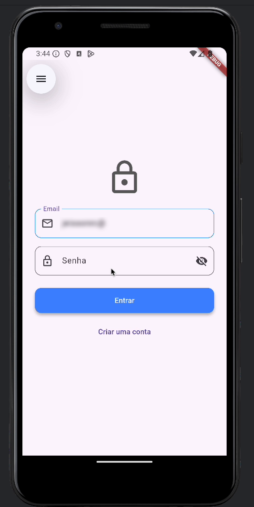
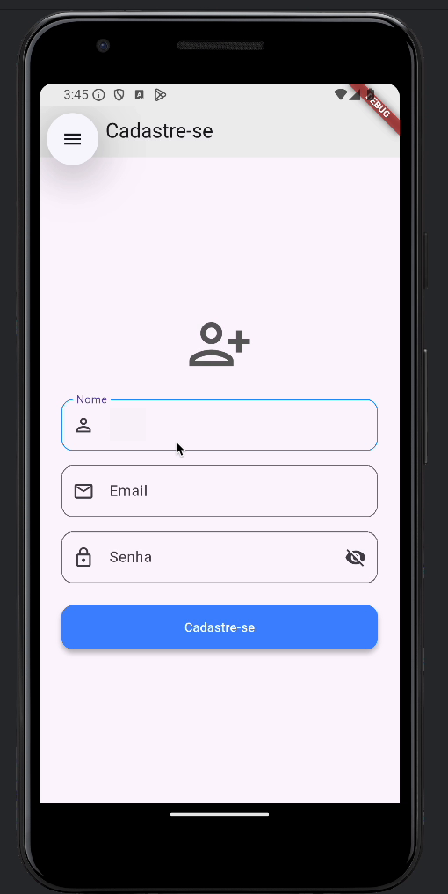
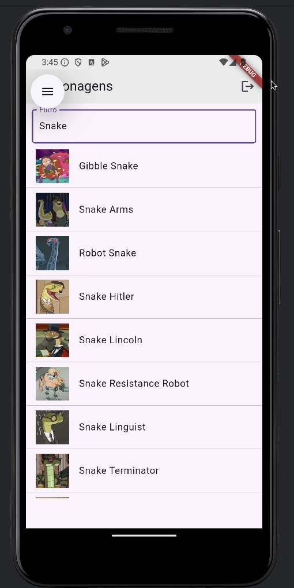
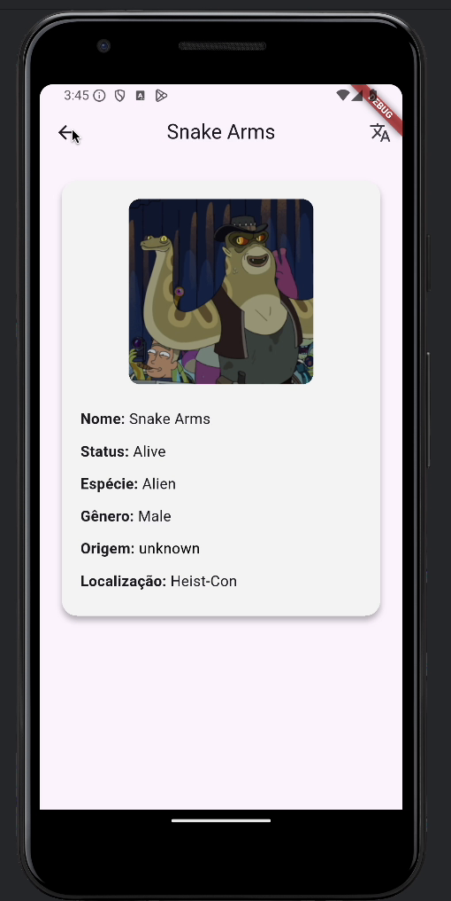
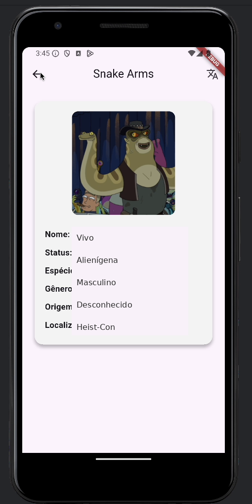
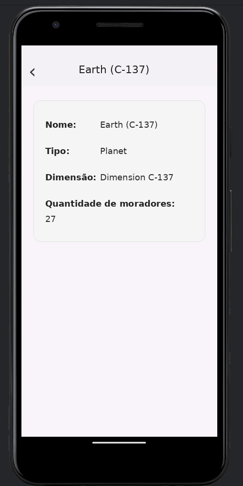

# Flutter Rick and Morty App

<p align="center">
  <strong>A Flutter mobile application integrating Firebase Authentication and the Rick and Morty API.</strong>
</p>

<p align="center">
  Academic project developed during the <strong>Mobile Systems Development (DSM)</strong> course at ULBRA.
</p>

<p align="center">
  🇺🇸 <strong>English</strong> · 🇧🇷 <a href="README.pt-BR.md">Português</a>
</p>

---

## 🚀 Highlights

- 📱 Flutter mobile application
- 🔐 Firebase Authentication
- 🌐 REST API integration
- 👽 Rick and Morty character exploration
- 🔎 Character search and filtering
- 📄 Character details
- 🌌 Related location and dimension navigation
- 📚 API pagination handling

---

## 📱 About the Project

This project was developed during the **Mobile Systems Development (DSM)** course at ULBRA.

The initial proposal was to apply concepts related to mobile application development using Flutter. During development, the project was expanded to explore integration with an external REST API, user authentication, filtering, navigation and relationships between resources.

The application combines **Flutter and Dart** with **Firebase Authentication** and the public **Rick and Morty API**.

Rather than simply displaying data from the API, the application allows users to explore characters, access their details and navigate through related location and dimension information.

---

## ✨ Features

### Authentication

- User registration
- User login
- Authentication validation
- Logout
- Firebase Authentication integration

### Characters

- Character listing
- Character search and filtering
- Character details
- Multiple-page API retrieval

### Locations and Dimensions

- Access to the location associated with a character
- Location details
- Navigation between related resources

---

## 🛠️ Technologies

### Core

- Flutter
- Dart

### Authentication

- Firebase Authentication

### API and Data

- HTTP
- REST API
- JSON
- Rick and Morty API

### Development

- Android Studio
- Git
- GitHub

---

## 🧩 Project Structure

The main application code is organized into three areas:

```text
lib/
├── models/       # Data models
├── pages/        # Application screens
├── services/     # API and authentication services
├── constants.dart
└── main.dart     # Application entry point
```

### Main Responsibilities

**models/**  
Contains the data structures used by the application.

**pages/**  
Contains the application's screens and user interface.

**services/**  
Contains the logic responsible for communication with external APIs and authentication.

This organization keeps the project easier to understand, maintain and evolve.

---

## 🔌 API Integration

The application consumes the public **Rick and Morty API**:

https://rickandmortyapi.com/

The API is used to retrieve character and location data.

The application supports:

- character listing;
- search and filtering;
- character details;
- navigation to related locations;
- retrieval of multiple API pages.

The project also explores relationships between resources, allowing information obtained from a character to lead to related location and dimension data.

---

## 🔐 Authentication

Firebase Authentication is used to manage the application's authentication flow.

The project includes:

1. User registration
2. User login
3. Authentication validation
4. Access to the application
5. Logout

---

## 🖥️ Screenshots

### Login



### User Registration



### Character List



### Character Details



### Character Details — Portuguese



### Planet and Dimension Details



---

## 🎬 Demo

A short demonstration of the application is available below:

[▶️ Watch the application demo](docs/media/rick-and-morty-flutter-demo-muted-blurred.mp4)

The demonstration shows the authentication flow, character exploration, filtering, character details and navigation through related information.

---

## 📚 Academic Context

This project was developed during the **Mobile Systems Development (DSM)** course at **ULBRA**.

The objective was to apply concepts related to mobile application development, API consumption and integration with external services.

During development, the project was expanded beyond the initial exercise to explore additional features such as character filtering, related resource navigation and API pagination.

Special thanks to **Professor Daniel Souza** for the concepts and guidance provided throughout the course.

---

## 🎯 What This Project Demonstrates

This project demonstrates practical experience with:

- Mobile application development
- Flutter and Dart
- Firebase Authentication
- REST API consumption
- JSON data handling
- API pagination
- Data modeling
- Filtering and queries
- Screen navigation
- Integration with external services

---

## 📌 Project Status

This is an **academic project** developed for learning purposes.

The repository preserves the version developed during the course and serves as a portfolio and study reference.

---

## 👤 Author

**Jeisson Rocha da Cunha**

GitHub:  
https://github.com/jeissonrc

Repository:  
https://github.com/jeissonrc/flutter-rick-and-morty-app

---

### 📷 Media

All screenshots and demonstration media used in this documentation are stored in:

```text
docs/media/
```
